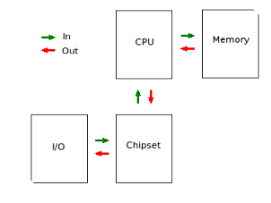

# abstractVM

## Concept Definition

Creation of a virtual machine in C++ capable of doing simple operations on assembler from a file or user input according to the diagram below. Among these operations, we find these:

- _comments_: They begin with a semicolon (;) and end at the end of a line. A comment may be indifferent at the beginning of a line or after an instruction.

- _push v_: Stack the v value at the top. The v value will naturally take one of the following forms: int8(n), int16(n), int32(n), float(z), double(z) or bigdecimal(z).
(For example : int16(n) - create an signed 16-bit integer with the value n)

- _pop_: Unstacks the value at the top of the stack.

- _clear_: Clears the stack. Rendering it empty.

- _dup_: Duplicates the value on the top of the stack, and stacks the copy of the value.

- _swap_: Reverses the order of (swaps) the top two values on the stack.

- _dump_: Display each value on the stack from the newest to the oldest, WITHOUT MODIFYING the stack. Each value is separated from the next with a line break.

- _assert v_: Verify that the value at the top of the stack is equal to the one passed as parameter in this instruction.

- _add_: Unstack the first two values in the stack, add them, and then stack the result.

- _sub_: Unstack the first two values in the stack, substract them, and then stack the result.
- _mul_: Unstack the first two values in the stack, multiply them, and then stack the result.

- _div_: Unstack the first two values in the stack, divide them, and then stack the result.

- _mod_: Unstack the first two values in the stack, calculate their modulo, and then stack the result.

- _load v_: Copy the value from the register v and stack it at the top.

- _store v_: Unstack the first value and store it to the register v.

- _ print_: Make sure that the value at the top of the stack is an 8-bit integer, then interpret it like an ASCII value and display the corresponding character on the standard output.

- _exit_: Quit the program execution that is underway.



## How to build the project

You build the project using CMake:

```
cmake .
```
```
make
```

Or directly with the Makefile given:

```
make
```

## Expected outcome

```
∼/B-SYN-400> ./abstractVM example.avm
42
42.42
3341.25
```
```
∼/B-SYN-400> ./abstractVM
push int32(2)
push int32(3)
add
assert int32(5)
dump
exit
;;
5
```
```
∼/B-SYN-400> ./abstractVM
pop
;;
Line 1: error: pop on empty stack.
```

## Epitech's moulinette result

_Global percentage: 75.7%_

### 1 - Unit Tests:

```
1A - Assert
PASSED
1B - Add
PASSED
1C - Add #2
PASSED
1D - Add #3
PASSED
1E - Sub
PASSED
1F - Sub #2
PASSED
1G - Sub #3
PASSED
1H - Div
Test failure: The output must match the regular expression '^OK
$', but it was 'KO: expected exit status 0 but got 84.
'
1I - Div #2
PASSED
1J - Div #3
keyboard_arrow_right
Test failure: The output must match the regular expression '^OK
$', but it was 'KO: expected exit status 0 but got 84.
'
1K - Mod
PASSED
1L - Mod #2
PASSED
1M - Mul
PASSED
1N - Mul #2
PASSED
1O - Dup
PASSED
1P - Pop
PASSED
1Q - Print
PASSED
1R - Push
keyboard_arrow_right
Test failure: The output must match the regular expression '^OK
$', but it was 'KO: expected exit status 0 but got 84.
'
1S - Swap
PASSED
1T - Clear
PASSED
1U - Clear #2
PASSED
```

### 2 - Parsing

```
2A - Comment
Test failure: The output must match the regular expression '^OK
$', but it was 'KO: expected exit status 0 but got 84.
'
2B - Inline comment
Test failure: The output must match the regular expression '^OK
$', but it was 'KO: expected exit status 0 but got 84.
'
2C - Space
PASSED
2D - Tab & Space
PASSED
2E - Tab
PASSED
```

### 3 - Advanced

```
3A - 2 * 1 + 3
PASSED
3B - 6*(4+5) - 25/(2+3)
PASSED
3C - (42 + 33) * 44.55; 42.42; 42
PASSED
3D - (256 * 34 + 21) * (344 + 12 + 23)
PASSED
3E - (256 + 34 * 21) + (344 + 12 + 23)²
PASSED
3F - (2.56 + 34 * 21) * (0.34 + 12 + 23)²
PASSED
3G - (566.0 - 2805 / 500)^3
PASSED
```

### 4 - BigDecimal

```
0% PASSED
```

### 5 - Registers

```
5A - Load & Store
PASSED
5B - Load
PASSED
5C - Load Empty
PASSED
5D - Store
PASSED
5E - Store #2
PASSED
```

### 6 - Type Cascading

```
6A - Add int16
PASSED
6B - Add int8
PASSED
6C - Div
PASSED
6D - Mul
PASSED
```


### 7 - Error Management
```
7A - Assert
PASSED
7B - Divide By Zero
PASSED
7C - Empty Stack
PASSED
7D - Missing Exit
PASSED
7E - Lexical Error
PASSED
7F - Lexical Error Simple #2
PASSED
7G - Lexical Error Simple
Test failure: The output must match the regular expression '^OK
$', but it was 'KO: expected exit status 84 but got 0.
'
7H - Modulo BigDecimal
PASSED
7I - Modulo By Zero
PASSED
7J - Modulo Double
PASSED
7K - Modulo Float
PASSED
7L - Not enough Values
PASSED
7M - Overflow #2
PASSED
7N - Overflow
PASSED
7O - Underflow #2
PASSED
7P - Underflow
PASSED
7Q - Unknown Instruction
PASSED
```